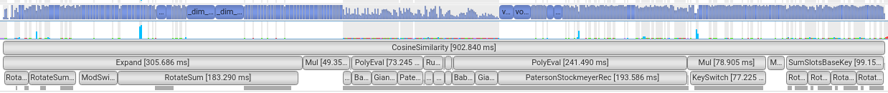

# Lattica Fetch-by-Similarity Submission

This document describes Lattica's submission to the Fetch-by-Similarity FHE benchmarking workload.

In this doc we provide a description of the workload structure, cryptographic parameterization, level and scale management, and performance characteristics of the submission. All data reported here corresponds to an end-to-end execution of the harness.

---

## Database Configuration

* **Mode:** SMALL
* **Database size:** 50,000 records
* **Record dimension:** 128
* **Payload dimension:** 7

The submission evaluates encrypted similarity queries against a fixed encrypted database and returns matching payloads.

---

## Execution environment

**Client**

* 13th Gen Intel(R) Core(TM) i9-13900H
* 20 CPUs, 32 GB RAM

**Server**

* AWS EC2 g6e.2xlarge
* NVIDIA L40S (48 GB)
* 8 vCPUs, 64 GB RAM

The client executes over a WAN connection (Israel ↔ us-east-1).

---

## Cryptographic parameters and security

The submission uses the following parameters:

* **Ring dimension:** 2**16 = 65536
* **Total modulus size:** ~1059 bits (693 compute levels + 366 GHS)
* **Secret key distribution:** sparse ternary, Hamming weight 64

Security estimate yields approximately 189 bits of security, exceeding standard 128-bit targets:
```python
from estimator import *
Logging.set_level(Logging.LEVEL0)
params = LWE.Parameters(n=2**16, q=2**1059, Xs=ND.SparseTernary(32), Xe=ND.DiscreteGaussian(1))
LWE.estimate.rough(params)
```

Result:

```
usvp                 :: rop: ≈2^189.5, red: ≈2^189.5, δ: 1.002820, β: 649, d: 128284, tag: usvp
dual_hybrid          :: rop: ≈2^189.2, red: ≈2^189.2, guess: ≈2^127.8, β: 648, p: 2, ζ: 0, t: 110, β': 648, N: ≈2^101.1, m: ≈2^16.0
{'usvp': rop: ≈2^189.5, red: ≈2^189.5, δ: 1.002820, β: 649, d: 128284, tag: usvp,
 'dual_hybrid': rop: ≈2^189.2, red: ≈2^189.2, guess: ≈2^127.8, β: 648, p: 2, ζ: 0, t: 110, β': 648, N: ≈2^101.1, m: ≈2^16.0}
```
---

## Pipeline levels breakdown

### 2D moduli chain

We are using a technique that we call a *2D modulus chain*, which allows us to decouple optimizations related to plaintext scaling via mod-switching, and optimizations related to the machine register size.

Each ROW of the our 2D chain is a single int64 number, which is the product of one or more “good” primes. Conceptually, each element in the 2D chain can be consumed as a level (in the context of mod-switching), so the overall number of levels is the sum of number of COLs in each ROW. However, the size and computational overhead grows with the number of ROWS rather than with the number of levels.

### Deferred modulus switching
In some cases we also postpone mod-switching until after multiple scales were accumulated. E.g. in `expand`, we perform 3 consecutive `ct*const` multiplications, each increasing the number of bits of the scale by 20, and only then mod-switch down by a full 60 bit row.

### Moduli chain structure
```python
full_q_list_precision=(
    (60,),     # expand
    (40,),     # mul_1: query * db
    (60, 30,), # chebyshev
    (60, 30,), # chebyshev
    (60, 30),  # chebyshev, running sum
    (60,),     # mul_2: running_sum * selectors  (indices)
    (61, 29,), # chebyshev
    (61, 30,), # chebyshev
    (61, 31,), # chebyshev
    (60, 30,), # chebyshev,   mul_3: masks * payloads
    (50,),     # mul_4: payloads * packing mask
    (60,),
),
level_sizes_running_sum = [8, 8]       # prod should be 64
level_sizes_expand      = [8, 4, 4]    # prod should be 128
g_base_bits             = 354          # decomposition basis
ghs_keyswtich_scale     = 6*(61,)      # scale-up by additional 366 bits

input_pt_scale    = 2**53
db_pt_scale       = 2**17
playload_pt_scale = 2**27
```

### Scale management and level consumption
The pipeline carefully controls scale growth and modulus switching to maintain precision throughout the computation. Key properties include:

* Deferred modulus switching after multiple constant multiplications.
* Explicit scale restoration before reduction-heavy stages.
* Varying input plaintext scales for db, query and payloads to optimize scale growth.

| **Step** | **Scale After Step (log2)** | **Level Sizes**                                                                                               | **Number of Levels Consumed** | **Comments**                                                                                                                                                                                                                                                                                                    |
|---|---:|---------------------------------------------------------------------------------------------------------------|---:|-----------------------------------------------------------------------------------------------------------------------------------------------------------------------------------------------------------------------------------------------------------------------------------------------------------------|
| query input | 53 | –                                                                                                             | – | –                                                                                                                                                                                                                                                                                                               |
| expand | 53 | `(60,), # expand`                                                                                             | 3 levels, each 20 bits (1 row) | We apply `ct * const` three times, where in each multiplication the constant is scaled up by 20 bits. We then mod-switch down once at the end of the operation by a full 60-bit modulus.                                                                                                                        |
| db input | 17 | –                                                                                                             | – | –                                                                                                                                                                                                                                                                                                               |
| query * db | 53 + 17 = 70 | –                                                                                                             | – | –                                                                                                                                                                                                                                                                                                               |
| first switch down | 70 − ~40 = ~30 | `(40,), # mul_1`                                                                                              | 1 (1 row) | –                                                                                                                                                                                                                                                                                                               |
| threshold cheb | ~28.5 | `(60, 30,), # chebyshev`<br>`(60, 30,), # chebyshev`<br>`(60, 30), # chebyshev, running sum`                      | 5 (2.5 rows) | Levels are consumed by ciphertext multiplications. Since there are not enough “good” primes close to 30 bits, the primes are slightly larger, and each multiplication and mod-switch reduces slightly more than 30 bits.<br><br>Scale evolution:<br>`29.9999 → 29.9217 → 29.8464 → 29.6221 → 29.1740 → 28.5026` |
| scale up before running sum | ~28.5 + ~11.5 = 40 | –                                                                                                             | – | –                                                                                                                                                                                                                                                                                                               |
| running sum | 40 | `(60, 30), # chebyshev, running sum`                                                                          | 2 levels, each 15 bits (0.5 rows) | We apply `ct * const` twice, where in each multiplication the constant is scaled up by 15 bits. We then mod-switch down once at the end of the operation by a full 30-bit modulus.                                                                                                                              |
| running sum * selectors | 40 + ~28.5 = ~68.5 | –                                                                                                             | – | –                                                                                                                                                                                                                                                                                                               |
| scale up | ~68.5 + ~22.5 = ~91 | –                                                                                                             | – | –                                                                                                                                                                                                                                                                                                               |
| second switch down | ~91 − ~60 = ~31 | `(60,), # mul_2`                                                                                              | 1 (1 row) | –                                                                                                                                                                                                                                                                                                               |
| indicators cheb | ~35.75 | `(61, 29,), # chebyshev`<br>`(61, 30,), # chebyshev`<br>`(61, 31,), # chebyshev`<br>`(60, 30,), # chebyshev, mul_3` | 7 (3.5 rows) | Scale evolution:<br>`31.0 → 29.98 → 32.61 → 31.59 → 30.57 → 31.59 → 32.65 → 35.75`                                                                                                                                                                                                                              |
| payload input | 27 | –                                                                                                             | – | –                                                                                                                                                                                                                                                                                                               |
| indicators * payload | ~35.75 + 27 = ~62.75 | –                                                                                                             | – | –                                                                                                                                                                                                                                                                                                               |
| scale up | ~62.75 + ~17.25 = ~80 | –                                                                                                             | – | –                                                                                                                                                                                                                                                                                                               |
| third switch down | ~80 − ~30 = 50 | `(60, 30), # chebyshev, mul_3`                                                                                | 1 (0.5 rows) | –                                                                                                                                                                                                                                                                                                               |
| extraction mask scale | 50 | –                                                                                                             | – | When packing the mask into slots, a custom scale is used.                                                                                                                                                                                                                                                       |
| results * extraction mask | 50 + ~50 = ~100 | –                                                                                                             | – | Constant multiplication                                                                                                                                                                                                                                                                                         |
| final switch down | 50 | `(50,), # mul_4`                                                                                              | 1 (1 row) | –                                                                                                                                                                                                                                                                                                               |
| output scale | 50 | `(60,), # q of output ct`                                                                                     | 1 (1 row) | –                                                                                                                                                                                                                                                                                                               |

---

---

## Example execution

```

[harness] Running submission for small dataset
          returning matching payloads
09:23:58 [harness] 1: Dataset generation completed (elapsed: 0.3254s)
09:24:16 [harness] 1.1: Communication: Get cryptographic context completed (elapsed: 17.9993s)
09:24:18 [harness] 2: Dataset preprocessing completed (elapsed: 1.0297s)
09:24:28 [harness] 3: Key Generation completed (elapsed: 10.1093s)
         [harness] Public and evaluation keys size: 1.1G
09:26:45 [harness] 3.1: Communication: Upload evaluation key completed (elapsed: 137.1794s)
09:27:13 [harness] 4: Dataset encoding and encryption completed (elapsed: 28.3497s)
         [harness] Encrypted database size: 2.8G
09:33:06 [harness] 4.1: Communication: Upload encrypted database completed (elapsed: 352.8103s)
09:33:06 [harness] 5: Encrypted dataset preprocessing completed (elapsed: 0.0002s)

         [harness] Run 1 of 3
09:33:06 [harness] 6: Query generation completed (elapsed: 0.0889s)
09:33:06 [harness] 7: Query preprocessing completed (elapsed: 0.0001s)
09:33:07 [harness] 8: Query encryption completed (elapsed: 1.2876s)
         [harness] Encrypted query size: 12.0M
09:33:21 [harness] 9: Encrypted computation completed (elapsed: 13.4931s)
09:33:23 [harness] 10: Result decryption and postprocessing completed (elapsed: 2.2252s)
         [harness] PASS (All 14 payload vectors match)
         [submission] GPU time: 1.038s
         [submission] Queue time: 0.183s
         [submission] Network time: 11.249s
[total latency] 564.8982s

         [harness] Run 2 of 3
09:33:23 [harness] 6: Query generation completed (elapsed: 0.269s)
09:33:23 [harness] 7: Query preprocessing completed (elapsed: 0.0001s)
09:33:25 [harness] 8: Query encryption completed (elapsed: 1.2694s)
         [harness] Encrypted query size: 12.0M
09:33:39 [harness] 9: Encrypted computation completed (elapsed: 14.1897s)
09:33:41 [harness] 10: Result decryption and postprocessing completed (elapsed: 2.2588s)
         [harness] PASS (All 0 payload vectors match)
         [submission] GPU time: 1.039s
         [submission] Queue time: 0.174s
         [submission] Network time: 11.988s
[total latency] 565.7903s

         [harness] Run 3 of 3
09:33:41 [harness] 6: Query generation completed (elapsed: 0.295s)
09:33:41 [harness] 7: Query preprocessing completed (elapsed: 0.0001s)
09:33:43 [harness] 8: Query encryption completed (elapsed: 1.2619s)
         [harness] Encrypted query size: 12.0M
09:33:59 [harness] 9: Encrypted computation completed (elapsed: 16.2125s)
09:34:01 [harness] 10: Result decryption and postprocessing completed (elapsed: 2.2884s)
         [harness] PASS (All 13 payload vectors match)
         [submission] GPU time: 1.04s
         [submission] Queue time: 0.181s
         [submission] Network time: 14.023s
[total latency] 567.8613s

All steps completed for the small dataset!
```

## Performance characteristics

* Evaluation key: ~1.1 GB
* Encrypted database: ~2.8 GB
* Encrypted query: ~12 MB
* Total inference time: 14.1897 s (**includes network time over WAN**)
* Compute inference time: 1.039 s (**compute time only**)


### Homomorphic computation time breakdown



* Expand: 306 ms
* Inner product: 50 ms
* Cheb threshold: 73 ms
* Running_sum: 21 ms
* Mul selectors X running_sum: 7 ms
* Cheb masks: 241 ms
* Extract and pack payloads: 200 ms

**Total encrypted compute time:** ~0.903 seconds

## Comparative reference

Relative to the reference OpenFHE implementation provided with the benchmark suite:

| **Stage** | **Lattica**                  | **OpenFHE**            |
| --- |------------------------------|------------------------|
| **Key Generation** | 10.1093 s                    | 8.11 s                 |
| **DB encryption** | 28.3497 s                    | 102.93 s               |
| **Encrypted computation** | 1.04 s (13.49 s  end-to-end) | 125.75 s |
| **Public & evaluation keys** | 1.1 G                        | 2.4 G                  |
| **Encrypted database** | 2.8 G                        | 5.6G                   |
| **Encrypted query** | 12 M                         | 24M                    |


* Encrypted computation is approximately **125x faster**.
* Ciphertext sizes (keys, database, query) are **2x smaller**.

All comparisons are performed at comparable security levels.

